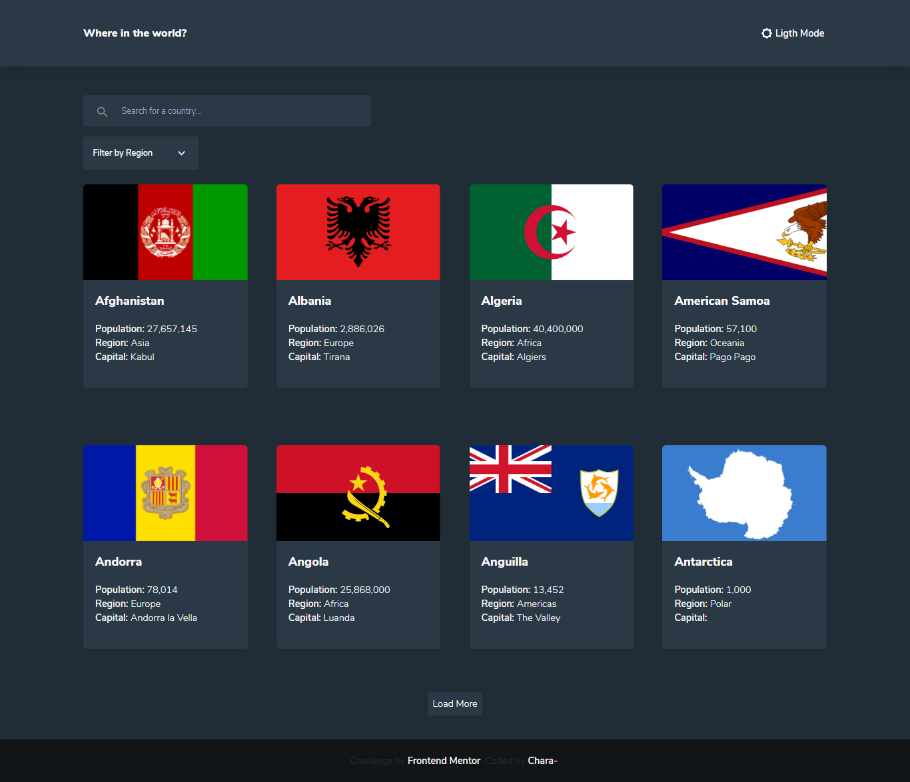

<h1 align="center">Rest Countries API</h1>

<div align="center">
   Solution for a challenge from  <a href="https://www.frontendmentor.io" target="_blank">Frontendmentor.io</a>.
</div>

<div align="center">
  <h3>
    <a href="https://rest-countries-api-lilac.vercel.app/" target="_blank" >
      Demo
    </a>
    <span> | </span>
    <a href="https://www.frontendmentor.io/profile/jcarlos0511" target="_blank" >
      Solution
    </a>
    <span> | </span>
    <a href="https://www.frontendmentor.io/challenges/rest-countries-api-with-color-theme-switcher-5cacc469fec04111f7b848ca" target="_blank" >
      Challenge
    </a>
  </h3>
</div>

<!-- TABLE OF CONTENTS -->

## 🔥 Table of Contents

- [Overview](#overview)
  - [Built With](#built-with)
- [Features](#features)
- [How to use](#how-to-use)
- [Contact](#contact)
- [Acknowledgements](#acknowledgements)

<!-- OVERVIEW -->

## Overview

<details>
  <summary>💻 Desktop version</summary>
    
  
  

</details>

<details>
  <summary>📱 Mobile version</summary>


</details>

### Built With

- [Axios](https://github.com/axios/axios)
- [Javascript](https://developer.mozilla.org/es/docs/Web/JavaScript)
- [React](https://reactjs.org/)
- [React-router-dom](https://reactrouter.com/web/guides/quick-start)
- [Tailwindcss](https://tailwindcss.com/)

## Features

This application/site was created as a submission to a [Frontendmentor](https://www.frontendmentor.io/challenges) challenge. The [challenge](https://www.frontendmentor.io/challenges/rest-countries-api-with-color-theme-switcher-5cacc469fec04111f7b848ca) was to build an application to complete the given user stories.

## How To Use

To clone and run this application, you'll need [Git](https://git-scm.com) and [Node.js](https://nodejs.org/en/download/) (which comes with [npm](http://npmjs.com)) installed on your computer. From your command line:

```bash
# Clone this repository
$ git clone https://github.com/jcarlos0511/rest-countries-api.git

# Enter the created folder
$ cd rest-countries-api

# Install dependencies
$ npm install

# Run the app
$ npm start
```

## Acknowledgements

- [Tailwind CSS For Absolute Beginners](https://medium.com/codingthesmartway-com-blog/tailwind-css-for-absolute-beginners-3e1b5e8fe1a1)
- [Steps to replicate a design with only HTML and CSS](https://devchallenges-blogs.web.app/how-to-replicate-design/)
- [Marked - a markdown parser](https://github.com/chjj/marked)

## Contact

- GitHub [@jcarlos0511](https://github.com/jcarlos0511)
- Twitter [@charalopez0511](https://twitter.com/charalopez0511)
